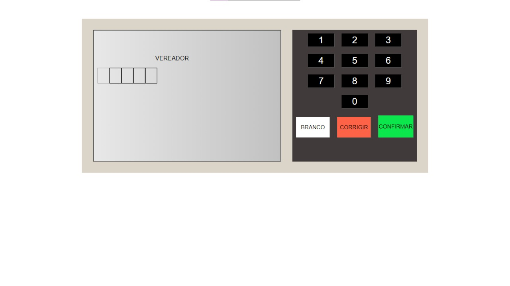

### O Desafio
Fazer uma urna eletronica para computar votos fictícios

### Screenshot

### Usado para codificar

- Semantic HTML5 markup
- CSS custom properties
- Flexbox
- CSS Grid
- Mobile-first workflow

### Continuar desenvolvendo

  Tenho como ambição continuar desenvolvendo para minha melhoria profissional!
  Tive varios desafios pela frente executando este exercício, porem consegui mais que imaginava

## Author

- Frontend Mentor - [@PatrickTav](https://www.frontendmentor.io/profile/PatrickTav)